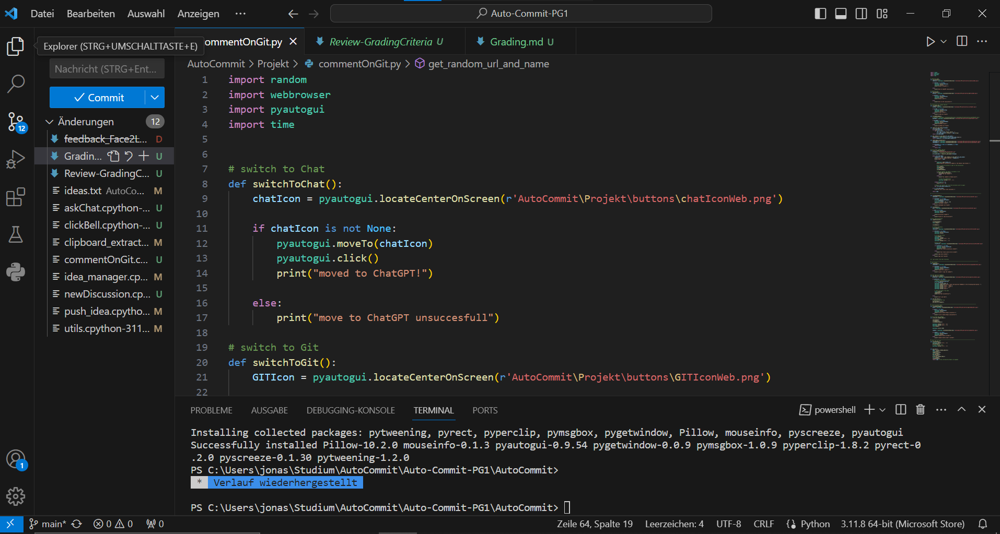
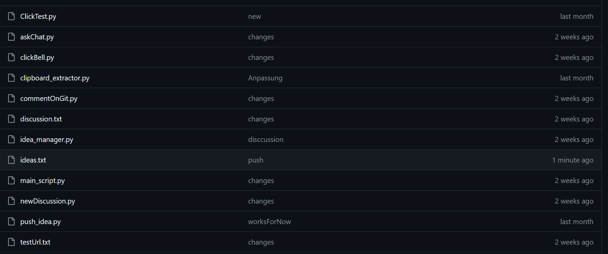
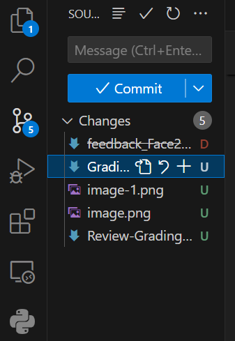
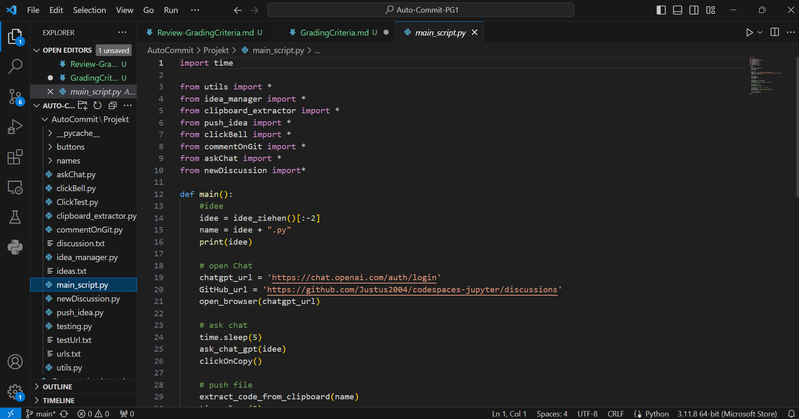

<!-- https://github.com/skills/communicate-using-markdown -->

# Grading Criteria Programmieren T3INF1004
In jedem Unterbereich werden die Punkte (gerne auch Links ins GIT) erklärt, wie das LO erreicht worden ist.
Alle Kriterien betreffen nur die Projektarbeit. Beweismaterial kommt aus dem Gruppenprojekt.

## FACHKOMPETENZ (40 Punkte)

# Die Studierenden kennen die Grundelemente der prozeduralen Programmierung. (10)
<!-- Siehe Kenntnisse in prozeduraler Programmierung: zutreffendes wählen und beweisen-->

Beispiel Code aus Projekt der prozedural programmiert wurde: https://github.com/Justus2004/Auto-Commit-PG1/blob/main/AutoCommit/Projekt/newDiscussion.py
In dem gegebenen Code wurden mehrere prozedurale Programmierkonzepte angewendet:

Funktionen: Der Code definiert mehrere Funktionen wie open_your_git(), new_disc(), type_theme(theme), und new_discussion_main(theme).

Variablen: Es werden Variablen verwendet, um Daten zu speichern und zu verarbeiten, z. B. new_disc, theme, usw.

Kontrollstrukturen: Bedingte Anweisungen (if-else) werden verwendet, um Entscheidungen zu treffen und entsprechende Aktionen auszuführen, z. B. in den Funktionen new_disc() und type_theme(theme).

Schleifen: Zwar sind in diesem konkreten Code keine Schleifen enthalten, jedoch könnten Schleifen verwendet werden, um bestimmte Operationen zu wiederholen.

Funktionsaufrufe: Die Hauptfunktion new_discussion_main(theme) ruft andere Funktionen auf, um eine bestimmte Aufgabe auszuführen. Dies demonstriert den prozeduralen Ansatz, Code in einzelne logische Einheiten zu strukturieren.

# Sie können die Syntax und Semantik von Python (10)
<!-- Eine Stelle aus ihrem Programmieren wählen auf die sie besonders stolz sind und begründen -->
Beispiel Code aus Projekt: https://github.com/Justus2004/Auto-Commit-PG1/blob/main/AutoCommit/Projekt/commentOnGit.py

Diese Stelle aus dem Projekt beinhaltet die wichtige Syntax und Semantik von Python:

Wichtige Syntax im Code:
Die Einrückung von Code Zeilen
Variablennamen fangen mit Buchstaben oder Unterstriche an
Es werden Kommentare durch ein # markiert
Einzelner Code wird durch Zeilenumbrüche getrennt

Wichtige Semantik im Code:
Variablentyp sind dynamisch -> kein fester Datentyp
Funktionen wurden korrekt erstellt mit Übergabeparametern
Kontrollstrukturen wie if/elif/else oder auch for/while und while-try+
Importierte Packete aus libary wurde auch angewandt

# Sie können ein größeres Programm selbständig entwerfen, programmieren und auf Funktionsfähigkeit testen (Das Projekt im Team) (10)
<!-- Anhand von commits zeigen, wie jeder im Projekt einen Beitrag geleistet hat -->
https://github.com/Justus2004/Auto-Commit-PG1/commits?author=Justus2004&since=2024-01-31&until=2024-02-26
Siehe PDF Datei Commits Justus 

# Sie kennen verschiedene Datenstrukturen und können diese exemplarisch anwenden. (10)
<!-- Eine Stelle aus dem Projekt wählen auf die sie besonders stolz sind und begründen -->

Wir haben in unserem Projekt nur Listen und dictionaries benutzt
Liste in dem Code https://github.com/Justus2004/Auto-Commit-PG1/blob/main/AutoCommit/Projekt/push_idea.py, in der Funktion "create_and_push_commit_file"

Dictionaries ist in dem Code https://github.com/Justus2004/Auto-Commit-PG1/blob/main/AutoCommit/Projekt/commentOnGit.py, in der Funktion "load_urls_and_names"

## METHODENKOMPETENZ (10 Punkte)

# Die Studierenden können eine Entwicklungsumgebung verwenden um Programme zu erstellen (10)
<!-- Beweise anbringen für Nutzen folgender Tools (können links, screenshots und screnncasts sein) -->
<!-- GIT -->
Siehe Commits

Wir haben Git mit unserem VSC verbunden um das Uploaden unserer Dateien zu vereinfachen 
<!-- VSC -->

Unser ganzes Projekt wurde mit VSC geschrieben 
<!-- ChatGPT -->

Unser Projekt besteht daraus ChatGPT Dinge zu Fragen und dessen Antwort zu kopieren 

## PERSONALE UND SOZIALE KOMPETENZ (20 Punkte)

# Die Studierenden können ihre Software erläutern und begründen. (5)
<!-- Jeder in der Gruppe: You have helped someone else and taught something to a fellow student (get a support message from one person) -->
Justus.B:
Ich habe Jonas.P geholfen das Übergeben der Parameter/Variablen bei Funktion zu verstehen.
Jonas.P:
Ich habe Justus.B die Bibliothek pyautogui nähergebracht und ihn eingewiesen.

# Sie können existierenden Code analysieren und beurteilen. (5)
<!-- Pro Gruppe:You have critiqued another group project. Link to your critique here (another wiki page on your git) and link the project in the critique, use these evaluation criteria to critique the other project. Make sure they get a top grade after making the suggested changes -->
Link zum feedback -> https://github.com/Justus2004/Auto-Commit-PG1/blob/main/feedback_Face2Led.md

# Sie können sich selbstständig in Entwicklungsumgebungen und Technologien einarbeiten und diese zur Programmierung und Fehlerbehebung einsetzen. (10)
<!-- Which technology did you learn outside of the teacher given input -->
eine neue technologie die wir außerhalb des Unterrichts kennengelernt haben war z. B pytorch, selenium, webbrowser,pyautogui usw.

<!-- Did you or your group get help from someone in the classroom (get a support message here from the person who helped you) -->
Nein, die meiste Zeit hat uns ChatGpt oder das Internet weitergeholfen. Manchmal hat Marvin Verbesserungen zur Einfachheit des Codes gegeben.

## ÜBERGREIFENDE HANDLUNGSKOMPETENZ (30 Punkte)

# Die Studierenden können eigenständig Problemstellungen der Praxis analysieren und zu deren Lösung Programme entwerfen (30)
<!-- Which parts of your project are you proud of and why (describe, analyse, link) -->

Die Datei CommentOnGit war eine Menge Denkarbeit, um alle Buttons zu finden und drücken. Außerdem den Commit schreiben.
Code->https://github.com/Justus2004/Auto-Commit-PG1/blob/main/AutoCommit/Projekt/commentOnGit.py

Der Idea_Manager war auch wichtig, da er die Grundlegende Ideen in einer Txt-Datei festgehalten hat und wir uns beibringen mussten aus Dateien zu lesen und sie umzuschreiben.
Code->https://github.com/Justus2004/Auto-Commit-PG1/blob/main/AutoCommit/Projekt/idea_manager.py
Allen im allen sind wir im Endeffekt damit zufrieden.

<!-- Where were the problems with your implementation, timeline, functionality, team management (describe, analyse, reflect from past to future, link if relevant) -->

implementation: Merge auf Git-Hub nicht sofor verstanden
Timeline: War ok vom Zeitmanagement her. EInziges Problem 10 minuten vor Präsentation ist die Main abgebrannt.
Functionality: Programm läuft in 80% der Fällen, aufgrund der Bibliothek, die nicht immer die Buttons mit den PNGs findet.
Team Management: Vieles wurde Zusammenprogrammiert, aufgrund der Tatsache, dass wir Git-Hub nicht verstanden haben.

Verbesserungsvorschläge: - Sich mit Git-Hub auseinander setzen um Zeitgleich an unterschiedlichen Sachen zu arbeiten.
			 - Nächstes mal eine andere Bibliothek verwenden um die Buttons zu finden.

## Kenntnisse in prozeduraler Programmierung:

# - Algorithmenbeschreibung
Code Beispiel: https://github.com/Justus2004/Auto-Commit-PG1/blob/main/AutoCommit/Projekt/idea_manager.py
Im Idea_Manager wurden die Algorithmen mit Kommentaren beschrieben. 

# - Datentypen
Beispiel code:https://github.com/Justus2004/Auto-Commit-PG1/blob/main/AutoCommit/Projekt/commentOnGit.py
Es wurden einfache Datentypen wie int,float,str,bool benutzt. 

# - E/A-Operationen und Dateiverarbeitung
Beispiel Code:https://github.com/Justus2004/Auto-Commit-PG1/blob/main/AutoCommit/Projekt/idea_manager.py
Die Datei beinhaltet Operationen wie: "open","writelines","readlines","print","append","pop","closed"

# - Operatoren
Code Beispiel:https://github.com/Justus2004/Auto-Commit-PG1/blob/main/AutoCommit/Projekt/commentOnGit.py
Es wurden Operatoren wie "+","=" oder "/" benutzt 
Weitere Operatoren die benutzt wurden sind "in","is not" etc.
Uns ist bewusst, dass das nicht alle Operatoren sind, aber wir sind trotzdem mit vielen mehr vertraut.
z.B. : "+","-","*","/","%","**","//","=","=+"etc.
Logische Operatoren wären: "and","or","not","is","is not","in","in not" etc.

# - Kontrollstrukturen
Code Beispiel:https://github.com/Justus2004/Auto-Commit-PG1/blob/main/AutoCommit/Projekt/commentOnGit.py
In der Datei werden Kontrollstrukturen wie if/elif/else oder auch for/while und while-try verwendet

# - Funktionen
Code Beispiel:https://github.com/Justus2004/Auto-Commit-PG1/blob/main/AutoCommit/Projekt/commentOnGit.py
In der Datei werden viele Funktionen mit Übergabeparametern erstellt.

# - Stringverarbeitung
Code Beispiel: https://github.com/Justus2004/Auto-Commit-PG1/blob/main/AutoCommit/Projekt/idea_manager.py
https://github.com/Justus2004/Auto-Commit-PG1/blob/main/AutoCommit/Projekt/main_script.py
Im Idea_Manager wurden die einzelnen Zeile aus einer Datei ausgelesen und in einem String gespeichert. Diese FUnktion wurde in der Main Datei aufgegriffen und der String dort gekürzt und dann mit dem String ".py" verknüpft.

# - Strukturierte Datentypen
Wir haben in unserem Projekt nur Listen und dictionaries benutzt
Liste in dem Code https://github.com/Justus2004/Auto-Commit-PG1/blob/main/AutoCommit/Projekt/push_idea.py, in der Funktion "create_and_push_commit_file"

Dictionaries ist in dem Code https://github.com/Justus2004/Auto-Commit-PG1/blob/main/AutoCommit/Projekt/commentOnGit.py, in der Funktion "load_urls_and_names"

